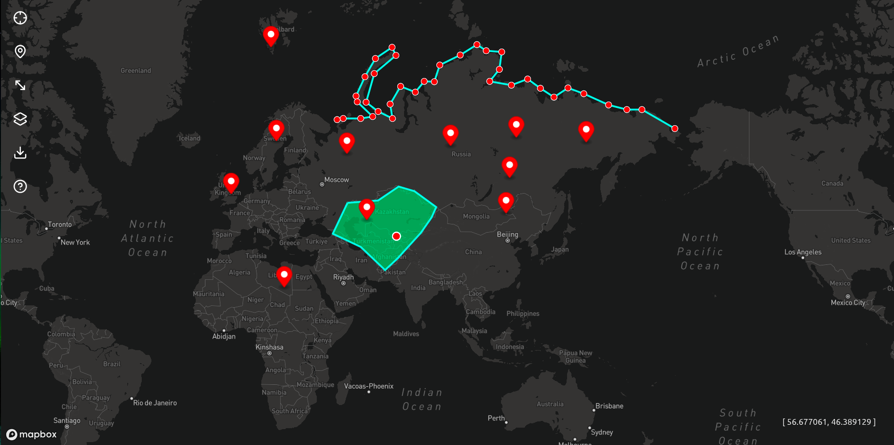

# MapCraft



**MapCraft** is an interactive map application that allows users to draw **markers**, **lines**, and **polygons** on a map, determine their **location**, and download them as a **GeoJSON** file.

---

## ⚙️ Technologies

- **Vite** — A fast frontend build tool
- **Vanilla JavaScript (ESM)** — Organized with modules
- **Mapbox GL JS** — Interactive map library
- **Lucide Icons** — UI icons
- **Tailwind CSS** — For minimal and modern styling

---

## 🚀 Key Features

- 🧭 **Interactive Map** — A modern, smooth map interface powered by Mapbox GL.
- 📍 **Add Markers** — Place markers at desired locations on the map and view their coordinates.
- 📏 **Draw Lines** — Draw paths or connections between any points.
- 🟦 **Create Polygons** — Define area or region boundaries.
- 📡 **Find Location** — Detect and display the user's current location on the map.
- 💾 **Download GeoJSON** — Save all drawn markers, lines, and polygons as a `.geojson` file.
- 🧩 **Modular System** — A clean, reusable code architecture with `utils/` and `modules/` structures.
- 🔧 **Extendable Design** — Easily add new modules (like the Help modal).

---

## 📁 Project Structure

```
/
├── public/
│   └── favicon.svg
├── src/
│   ├── modules/
│   │   ├── download.js   # Download functionality
│   │   └── help.js       # Help modal module
│   ├── ui/
│   │   └── style.css     # Main styles
│   ├── utils/
│   │   └── geojson.js    # GeoJSON creation logic
│   └── main.js           # Application entry point
├── .gitignore
├── index.html
├── package.json
├── vite.config.ts
└── README.md
```

---

## 🚀 Getting Started

1.  **Clone the repository:**

    ```bash
    git clone https://github.com/firdavsdev07/MapCraft.git
    ```

2.  **Navigate to the directory:**

    ```bash
    cd MapCraft
    ```

3.  **Install dependencies (using `pnpm` or `npm`):**

    ```bash
    # using pnpm
    pnpm install

    # or using npm
    npm install
    ```

4.  **Create a `.env` file:**
    In the project root, create a file named `.env` and add your Mapbox access token:

    ```env
    VITE_API_TOKEN=YOUR_MAPBOX_ACCESS_TOKEN
    ```

    _Replace `YOUR_MAPBOX_ACCESS_TOKEN` with your actual token from Mapbox._

5.  **Run the project:**

    ```bash
    # using pnpm
    pnpm dev

    # or using npm
    npm run dev
    ```

The application will open at `http://localhost:5173`.
