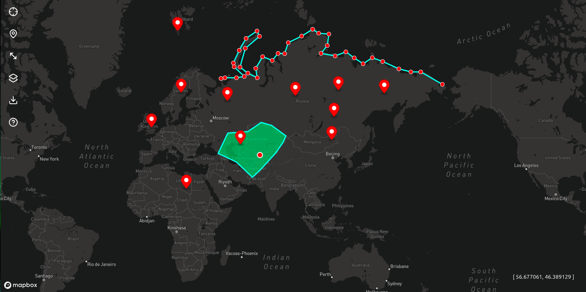

# MapCraft



**MapCraft** — bu interaktiv xarita ilovasi bo‘lib, foydalanuvchi xaritada **markerlar**, **chiziqlar (line)** va **poligonlar (polygon)** chizishi, **joylashuvini aniqlashi** hamda ularni **GeoJSON** fayli sifatida yuklab olishi mumkin.

---

## ⚙️ Texnologiyalar

- **Vite** — tezkor frontend muhiti
- **Vanilla JavaScript (ESM)** — modullar orqali tashkil etilgan
- **Mapbox GL JS** — interaktiv xarita kutubxonasi
- **Lucide Icons** — UI ikonlar
- **Tailwind CSS** — minimal va zamonaviy uslub

---

## 🚀 Asosiy imkoniyatlar

- 🧭 **Interaktiv xarita** — Mapbox GL yordamida ishlovchi zamonaviy, silliq xarita interfeysi
- 📍 **Marker qo‘shish** — xaritada kerakli joyga marker o‘rnatish va koordinatalarini ko‘rish
- 📏 **Chiziq (Line) chizish** — istalgan nuqtalar orasida yo‘l yoki bog‘lanish chizish
- 🟦 **Polygon yaratish** — hudud yoki maydon chegaralarini belgilash
- 📡 **Joylashuvni aniqlash** — foydalanuvchining hozirgi joylashuvini aniqlash va xaritada ko‘rsatish
- 💾 **GeoJSON yuklab olish** — barcha chizilgan marker, line va polygonlarni `.geojson` fayli sifatida saqlab olish
- 🧩 **Modul tizimi** — `utils/` va `modules/` strukturasida toza, qayta ishlatiladigan kod arxitekturasi
- 🔧 **Kengaytiriladigan dizayn** — yangi modullar (masalan, Help oynasi) oson qo‘shilishi mumkin

---

## 📁 Loyihaning tuzilmasi

```
/
├── public/
│   └── favicon.svg
├── src/
│   ├── modules/
│   │   ├── download.js   # Yuklab olish funksiyasi
│   │   └── help.js       # Yordam oynasi moduli
│   ├── ui/
│   │   └── style.css     # Asosiy uslublar
│   ├── utils/
│   │   └── geojson.js    # GeoJSON yaratish logikasi
│   └── main.js           # Ilovaning asosiy kirish nuqtasi
├── .gitignore
├── index.html
├── package.json
├── vite.config.ts
└── README.md
```

---

## 🚀 Ishga tushirish

1.  **Loyihani yuklab oling:**
    ```bash
    git clone https://github.com/Firdavs2003/MapCraft.git
    ```

2.  **Papkaga o'ting:**
    ```bash
    cd MapCraft
    ```

3.  **Bog'liqliklarni o'rnating (`pnpm` yoki `npm` orqali):**
    ```bash
    # pnpm orqali
    pnpm install

    # yoki npm orqali
    npm install
    ```

4.  **`.env` faylini yarating:**
    Loyihaning asosiy papkasida `.env` nomli fayl yarating va ichiga Mapbox tokeningizni joylashtiring:
    ```env
    VITE_API_TOKEN=YOUR_MAPBOX_ACCESS_TOKEN
    ```
    *`YOUR_MAPBOX_ACCESS_TOKEN` o'rniga o'zingizning Mapbox'dan olgan maxsus kalitingizni qo'ying.*

5.  **Loyihani ishga tushiring:**
    ```bash
    # pnpm orqali
    pnpm dev

    # yoki npm orqali
    npm run dev
    ```

Ilova `http://localhost:5173` manzilida ochiladi.